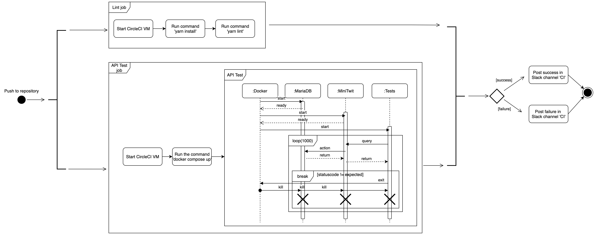
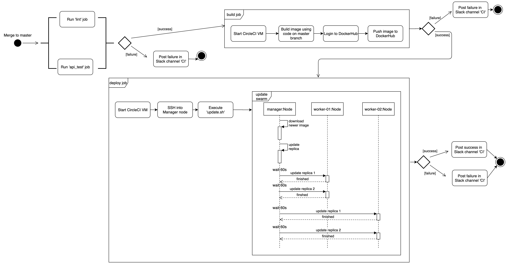
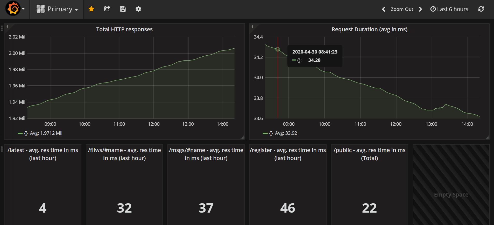
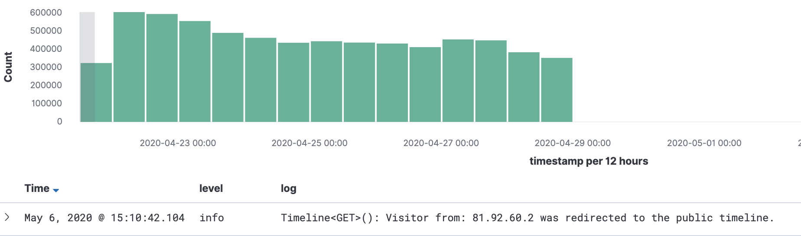

## Process's Perspective

### How do you interact as developers?

Prior to the Corona lockdown, we met up once a week for the lectures and would discuss/allocate tasks afterwards. For communication between lectures, we used Slack where we would discuss details and ask for advice and help as needed.
After the lockdown happened, we've been more active on Slack regarding organization and still asking for advice and help. More communication was a clear reaction to the lockdown.

We did also use Github issues and projects at the start of the project to manage the work we had to do, but later concluded that this was not beneficial to us, since the weekly assignments were small enough to discuss on Slack without developers missing key conclusions and dicussions in regards to the assignemnts.

### How is the team organized?

We are 4 team members with varying skills. We did not give memebers separate conserns (e.g. backend vs. frontend) but instead we delegated tasks each week based on the assignments instead.

Our level of expertise differed and some of us had greater knowledge into the chosen technology stack and hence some could be seen as experts.

Most worthwhile to note would be Lasse, as he was the primary drive force behind choosing NodeJs and TypeScript as well as getting progress made on the project. Lasse became the defacto expert primarily because he was the only member with experience regarding NodeJs and TypeScript.

### A complete description of stages and tools included in the CI/CD chains

Our CI/CD chains are triggered using CircleCI. Our chains rely on artifacts/tools from GitHub, Docker, DockerHub and Yarn, which is a package manager.

We have two different CI/CD chains.
One is called 'commit' and has the two jobs called 'lint' and 'api_test', which is triggered every time there is pushed to our repository (on any branch) and its purpose is to verify the quality of the code pushed.

The other is called 'deploy' and has four jobs called 'api_test', 'lint', 'build' and 'deploy'. The 'deploy' chain only runs on merges to the master branch and its purpose is first to verify that code is relaible and of sufficient quality and only then is an image build and pushed to DockerHub. Afterwards the deploy occurs which updates our Docker Swarm containers using rolling updates with 60s delays between each rollout.

All jobs, through CircleCI, spins up a Docker VM with a container based on the image circleci/node:13.8.0 whereas the API-test job uses the image circleci/python:3.8 because the tests are written in Python.
The 'lint' job/stage runs `yarn install` to install dependencies and then `yarn lint` to lint the code which checks for code smells and technical debt.
The 'api_test' job/stage moves to the test directory and run `docker-compose run tests` followed by `docker-compose down`, which blackbox tests our API with 1000 queries. In case any of these queries fails in any way then we deem that the published code is not reliable enough and hence we stop the pipeline here.
The 'build' job/stage logs onto DockerHub before running `docker build` to build the latest version of the application before pushing it to DockerHub using `docker push`.
The 'deploy' job/stage uses SSH to connect to the Docker Swarm host machine and executes the script in update.sh supplying the relevant Docker credentials in order to perform the rolling update.

After a pipeline is completed then CircleCI posts a message to our Slack channel reporting the result of the pipeline, allow developers to respond immediately in case an error occurs, without having to constantly refresh the CircleCI UI.

In the image below a visualisation of the 'commit' pipeline, managed by CircleCI, can be seen in the image below.

The 'deploy' pipeline can be seen in the image below. Please note that the expansion of the 'api_test' and the 'lint' job can be seen in the image above.

### Organization of your repositor(ies)

Originally, we had a mono-repository on github.itu.dk with all artifacts. However, when it was time to add CI/CD tools to the project, our choice of tool did not work with GitHub repositories on GitHub Enterprise setups and therefore we migrated to github.com, where we still used a monorepository.
The artifacts stored on the repository include Docker configuration files, Prometheus configuration file, Yarn configuration file, CircleCI configuration file, a pdf of our security report, test files and all the NodeJs server files as TypeScript, HTML and CSS.

The reason we opted for a monorepository was due to the fact that the project itself is relatively small, and we therefore concluded that it did not need to be separated into smaller repositories in order to allow developers to keep an overview of the code.

Furthermore our monorepo structure allows for developers to easily change between components if one needs to make a minor change in one to function with a new feature made in another.

### Applied branching strategy

We opted to use part of the GitFlow branching strategy in this project. This meant that all new features was developed in feature branches and merged to a development branch, which contained new features that have not been deployed yet. The master branch is reserved for stable code that will automatically be deployed whenever code is merged to this branch.

We never had to use hotfix branches since we did not encoutner major issues that needed to be fixed in our production code. The only scenario where this could have been done was when we fixed our own artifically indcued regression during the penetration testing assignment.

Finally we also chose not to use release branches since we found that pull-requests to master provided us with enough confidence in the code. In case we had opted to use staging environments, then maybe release branches would have made more sense.

To adhere to this branching strategy we locked the master and development branch, which means that no developer could push directly to these branches. Also, when merging a feature branch to develop or the develop branch to master then we enforced that code review must be performed by other developers in order to further ensure the code quality and to catch bugs early.

### Applied development process and tools supporting it

Part way through the project there was an attempt at using GitHub Issues to track tasks but partly due to the migration needed for the CI/CD tool and the migration not including the issues, this naturally fell apart.
From the beginning, the group had discussed and allocated tasks after lectures and it was almost always the case that the number of tasks was sufficiently small that this agreement was enough for us. The use of Git-Flow and feature branches also meant an easy way to track the progress from an overview perspective.

As argued earlier then we felt that this provided us with the overview we needed for this project and hence we did not employ further measures to ease our development process.

### How do you monitor your systems and what precisely do you monitor?

Monitoring the system is done with Prometheus and Grafana.
We monitor the total number of HTTP responses, the average request duration across all requests, the average response time for requests to the /latest route, the average response time for requests about the followers of a given user, the average response time for requests for the messages made by a given user, the average response time for requests for registering a user, and the average response time for requests for the frontpage.

While these metrics allows us to assess the general health of our endpoints, allowing us to react slow response times, then our monitoring could be further enhanced.

As an example we could include metrics on the servers health (CPU, Disk usage, etc.) directly in Grafana, since it is only available on the Digital Ocean dashboard right now. Furthermore it might also have been possible to aggregate our data differently to expose issues quicker. Perhaps we could have compared current response times with those an hour ago to see if any regressions has occurred?

### What do you log in your systems and how do you aggregate logs?

For aggregating logs, we use the ELK Stack. Logstash is used for the aggregation itself, while ElasticSearch stores the logs in a fashion that allows for efficient queries and visualisation in Kibana of the logs.

The generation of the logs in our program is done using the Winston logging framework, and we use a variety of log levels based on what we are logging. The levels we have used are the following:

* Info
* Warning
* Error

And we have been logging at these areas of interest

* We log all access to endpoints using the 'info' level, including relevant metadata
* We log all user related errors (during login, register etc.) using the 'info' level, including relevant metadata
* We log every time we enter a control flow that is used for error correction with the 'warn' level.
* We log all exceptions and errors in our program that cannot be recovered from using the 'error' level.

### Brief results of the security assessment

Brief overview of our security flaws:

* Our password hashing configuration is currently available in our source code to the public at the moment. Allowing malicious agents to crack user passwords.
* Our API is currently exposed, allowing malicious agents to act on behalf of registered users allowing the bypassing of our limited security of passwords.
* Our server is not protected beyond that of a regular server, meaning malicious agents would be able to erase logs or their own tracks.

As for our risk matrix:

* **Medium Risk with high impact** The risk of exposing user passwords is expected to be quite low since the access to the server is only through ssh. But our site is running on http, therefore it would be easy to sniff internet traffic for sensitive information such as raw passwords.
* **High Risk with medium impact** The risk of a hacker acquiring access to our hashing configuration is as simple as accessing the public repository on GitHub.
* **Medium Risk with medium impact** Since we don't really protect our API it is possible for malicious agents to send additional messages that can bypass password security.
* **Low Risk with high impact** Any access to our servers from malicious agents would give access to the production server. Allowing them to alter data in the production database. including passwords and usernames.

#### Pen testing our system

Following the OWASP ZAP and top 10. We have attempted to test our own system, this is in short the results of such testing.

* **OWASP ZAP and injection** running OWASP ZAP we discovered that we have exposed our tech stack, allowing for malicious agents to make targeted attacks, or use known exploits on certain systems. We did conclude however, that our system is very resilient to injection due to ORM sanitation and not handling user input directly.

* **Broken Authentication** We have implemented slight mitigation by limiting by IP-addresses, meaning that repeated attempts from the same IP, will be locked out of the system for a short while thus limiting a rapid fire brute force approach. Furthermore we have also implemented countermeasures against giving information to an attempted intrusion. Our first implementation gave individual errors regarding username or password and which of them was wrong. We have since then implemented a singular error to portray only a single error alerting the user that either or, could be wrong.

Please refer to our Security Report for additional details and argumentation.

### Applied strategy for scaling and load balancing

We have opted to use Docker Swarm to achieve scaling and load balancing, since it seemed considerably more scalable than a hot and standby server setup. Furthermore, we chose Docker Swarm since it also automatically restarts our services in case they ever go down. Finally Docker Swarm allows to easily scale our application horizontally by running a single command that adds new replicas to the swarm.

We use rolling updates when deploying our application, using five replicas across three nodes, with a 60 second delay during each update. This allows us to detect issues during the deployment and terminate the update early in case something is going wrong with newly updated replicas and at the same time it allows is to have 100% uptime during deployments since Docker Swarm also handles load balancing between our replicas.

This setup helps both with congestion and it removes our MiniTwit application as a single point of failure. However, we still only run a single database container, so in case this ever fails then the whole application can still fail. Given more resources and time then this would have been considered in the future.
