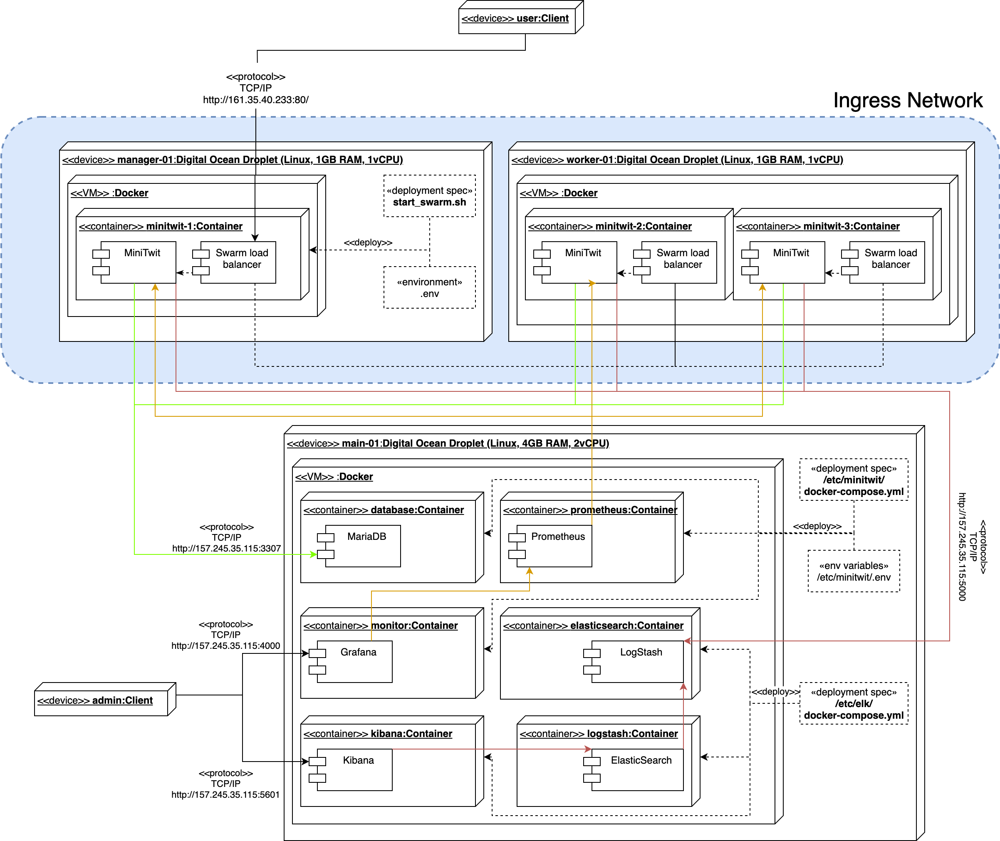
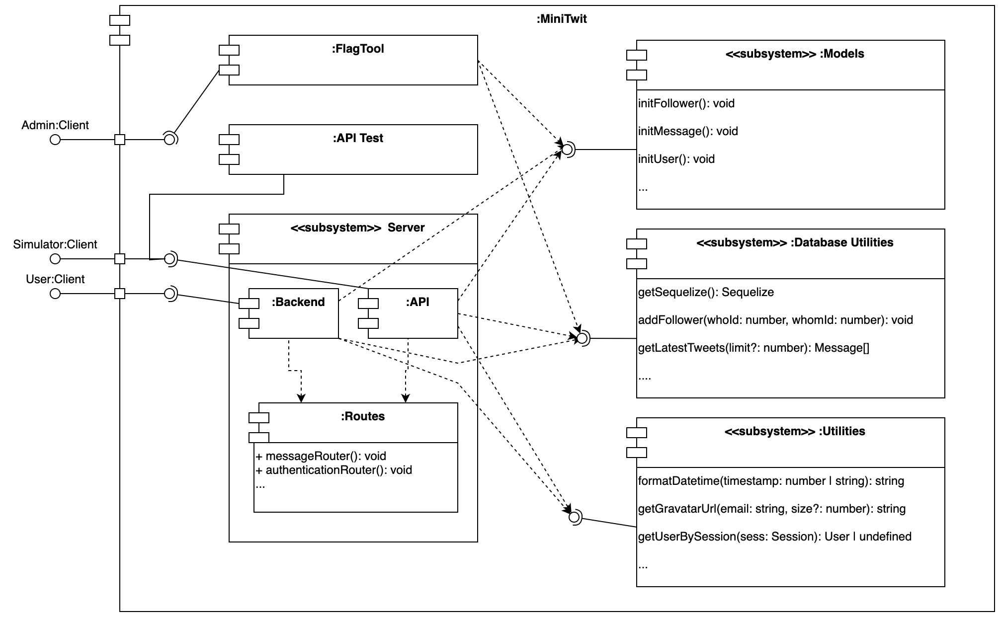
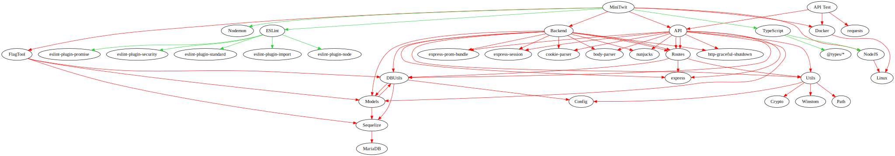
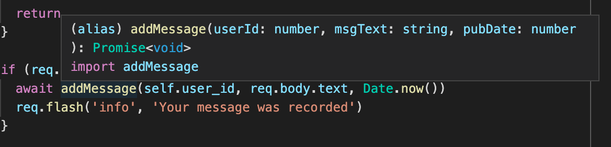
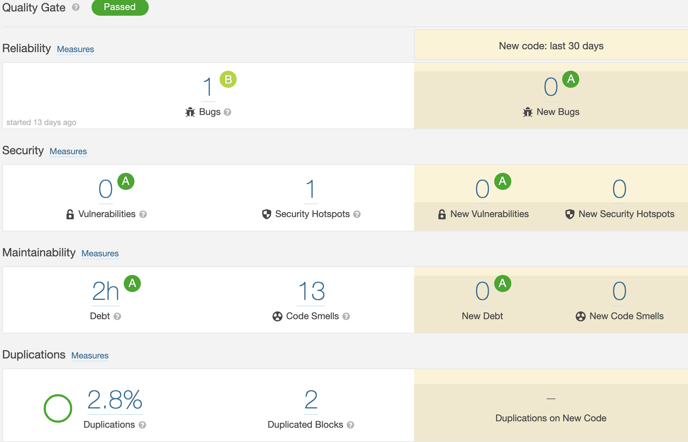

## Systems perspective

### Architecture of our system

In this section we will discuss how our MiniTwit implementation works from a high level perspective, including its overall interaction with different systems.

During the initial refactoring of MiniTwit we opted to use TypeScript as the
coding language and Node.JS as an environment to execute the written code on a
backend. To store data we have opted for a MariaDB database.

Our application was then dockerized in order to easily deploy our application on
different servers based on our needs. Furthermore, to orchestrate our application
we have been using Docker Swarm with five replicas.

We are using four different servers hosted on DigitalOcean to run our application, where two of these servers solely function as Worker Nodes (with two replicas each) for our Docker Swarm setup and the third functions as a Manager Node. The final server has been our main server before we introduced our scaling and load-balancing solution, and this is the server that contains our database instance and our logging and monitoring containers.

Please refer to the Deployment diagram below which illustrates the structuring of our system across servers and the overall interactions between different containers.



The following points describe certain aspects and observations of the diagram above:

* The MiniTwit component will be expanded in the following section.
* The ingress network depicted only shows one manager and one worker node. This is
done to keep the diagram a bit less complex. However, as stated then we have two worker nodes in our Swarm and the second worker node is identical to the first.

### Design of our system

In this section we will discuss the inner workings of the MiniTwit component which was seen in the Deployment Diagram in the previous section, since this is the core system of our application.

Our MiniTwit application is constructed by the use of several different components:

* FlagTool, which allows an administrator to flag messages
* API, which handles requests from the simulator
* Backend, which handles requests from users and serves the frontend
* API Test, which includes a python implementation that blackbox tests our API with 1000 queries (e.g. Register, Follow, Unfollow) and verifies that our API responds as expected.
* Database utilities, which contains functions that handles interaction with the MariaDB database. This component is built on top of Sequelize, an ORM, in order to be able to easily change our underlying database, if such a need should occur.
* Models, which contains models describing commonly used structures throughout the application.
* Routes, which is a collection of logic for all endpoints in the application.
* Utilities, which is a collection of functions that can be used across the components listed above.

To see the relationship of these components, please refer to the Component Diagram below. Please note the following when interpreting the diagram:

* Only some methods from components are listed. This is done to provide an overview of the purpose of each component, without making the diagram overly complex.



The interfaces between the components displayed in the Component Diagram will be explored in the Subsystem Interactions section.

### Dependencies

The dependency graph for our Minitwit application can be seen in the Directed Acylic Graph below, where the green edges visualise dependencies used during development and the red edges visualise run-time dependencies.



The following interesting observations can be made from the image above:

* There are a few bi-directional dependencies between our own subsystems (e.g. Database utilities and Models). These components depend on little from each other and, given more time, could be refactored to achieve even cleaner subsystem interfaces to both ease understandability and reducing coupling. In the scenario above the Models-component could be refactored to not depend on DBUtils.
* Generally dependencies between components are uni-directional, which is purposely done to increase the maintainability of the code.

### Subsystem Interactions

#### Internal interactions

As mentioned in the previous section the focus of our components have been to have a low coupling or, at least, keep our dependencies between our components uni-directional. The purpose of this is to keep our code maintainable, and allow developers to develop separate components without necessarily having to dive into other components. In other words this structure allows us to separate the concerns of the developers on this project in case it should grow too large for one developer to realistically maintain a detailed overview of everything in the codebase.

However, even though we have aimed to keep the coupling between our components low, they still need to interact. The interaction between our components is formalized through same-language interfaces.

TypeScript handles these interfaces by default, and these can be extracted directly from the source code in files with the extenstion `.d.ts`. These files contain the publicly exposed methods and fields from each component. Below can be seen a snippet from the Utils-component interface:

```typescript
...

declare module 'utils' {
    export * from 'utils/getUserBySession';
    export * from 'utils/handleUncaughtException';
    ...
}

declare module 'utils/getUserBySession' {
    import { User } from 'utils/--/models';
    export function getUserBySession(sess: Express.Session | undefined): User | undefined;
}

...
```

These files can be extracted through the command `yarn interface` and will even include related comments for each item in the interface (if any).

This will allow developers to get a overview of what each component does and what it exposes. However, this is generally not needed since these interfaces are deeply integrated into the editor that we use for this project (Visual Studio Code), which means that the documentation of used functions can be seen directly in the context of where they are used. See the image below for an example, where the interface of the `addMessage()` function from the DBUtils component can be seen in the context of where it is used in the Routes component.



#### API Interactions

Publicly we also expose a set of endpoints that can be used to interact with our system through REST operations. These endpoints would ideally also have an interface available such that external developers would know how to interact with our system.

Such an interface however has not been constructed because our API should not be used by developers other than those who invented the Simulator, and they were the ones providing the interface our API should adhere to.

### Current state

Now that the our MiniTwit project has ended, it is also time to assess the state of our application, and we believe that our system is in a good state in terms of maintainability, reliability, portability and modifiability.

We base these claims on the following:

* We have had static analysis of our source code since the initial refactoring. This has allowed us to catch code smells during development and enforced a strict ruleset of how code is written in this project to avoid arguments regarding proper formatting while (hopefully) allowing different developers to understand each others' code more easily. This was done to improve maintainability.
* We have employed static analysis and system testing in our CI pipeline, which will stop deployments in case our application fails in any way. This was done to improve the reliability of our project.
* Our application runs in Docker containers which means that there are no strict requirements to the operating system other than being able to run Docker. This was done to improve the portability of our project.
* The design of our system, as described in the previous sections, was made to improve modifiability and maintainability of the project.
* As far as we have been able to monitor ourselves we have been able to live up to our SLA, which can be seen as our application being reliable.

However, it should also be noted that we believe that another important reason of why we believe that this project is in a good state is due to the relatively small size of the project. In case the project were to evolve over several years, then the technical debt should be repaid frequently in order to avoid the system deteriorating over time.

Finally there are also some clear issues with the system that should be dealt with relatively soon if the state of the system should remain. These are as follows:

* Documentation is poor. There are few comments in the source code describing why choices have been made and the README.md could be improved to ease onboarding of new developers.
* While some of the most pressing security matters found during our security review has been fixed, some still exist and these should be dealt with. This has been discussed in our Security Report.
* SonarCloud.io reports that there are 2 hours of technical debt, 2.8% code duplication and 1 minor bug, which can be seen in the image below. While these are relatively minor issues with regards to the quality of the project, they still exist and may potentially 'snowball' in the future and therefore should be dealt with as soon as possible. It is worth noting that 6 of the 13 code smells are mentioned due to a mismatch of the exported variable and the name of the file for 6 different files corresponding to end points.


