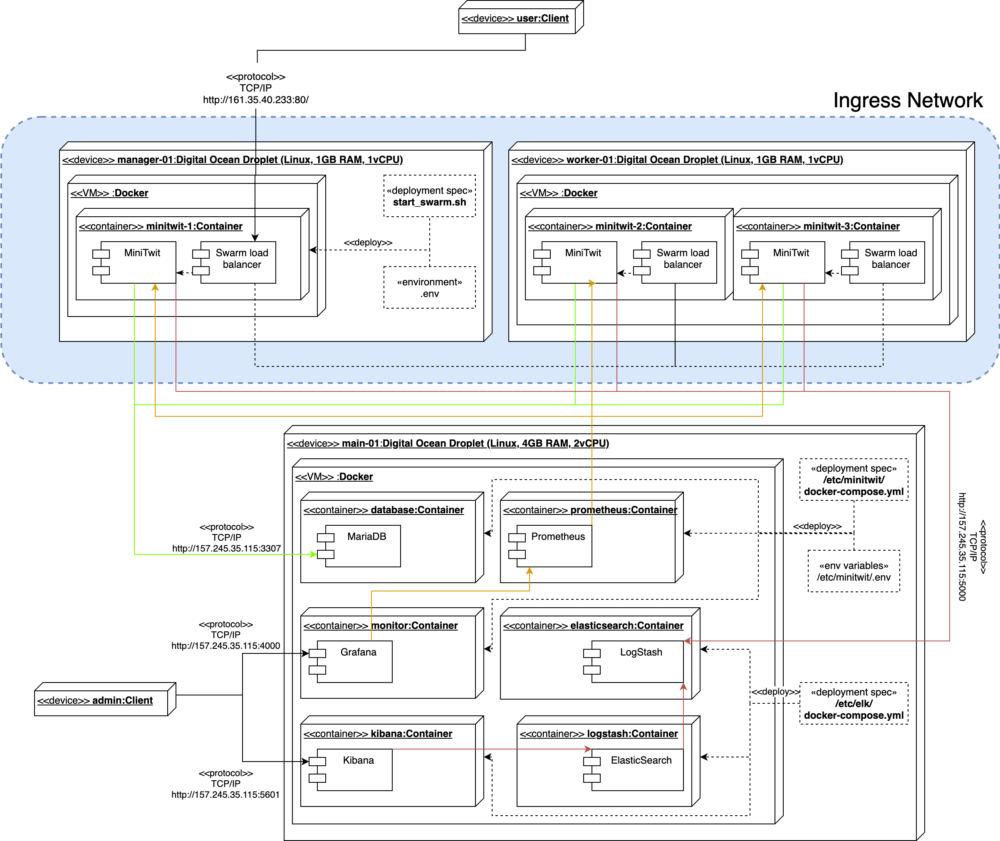
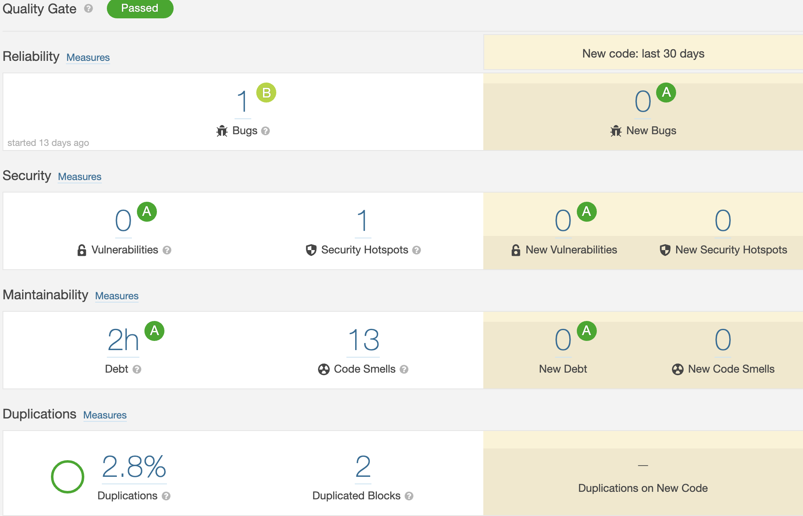
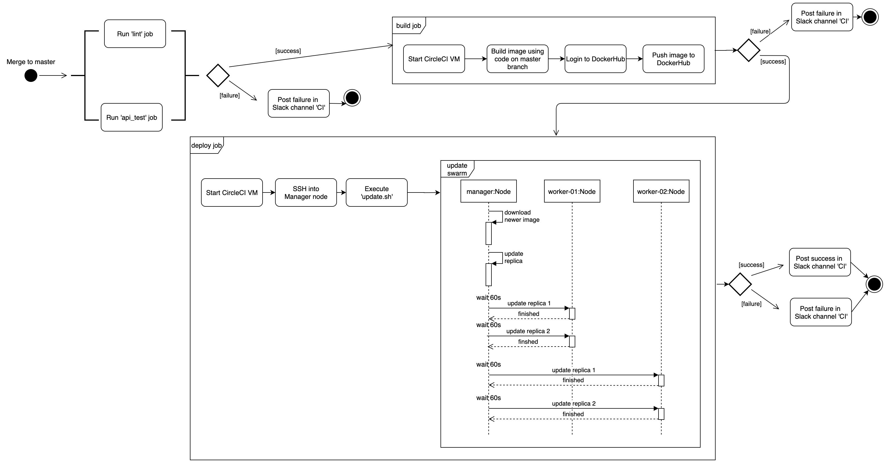
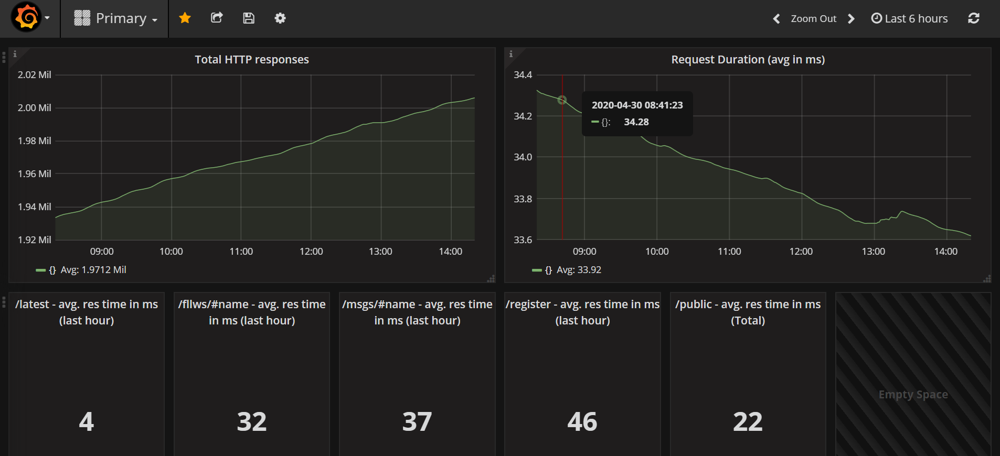
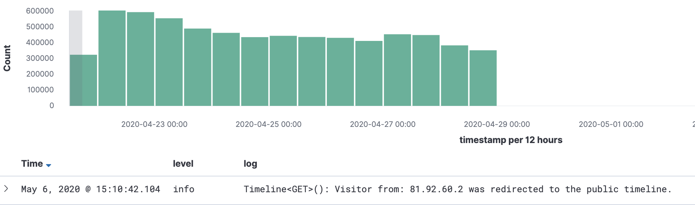

# DevOps - MinitwitTDB

* Lasse Felskov Agersten, lage@itu.dk
* Niclas Valentiner, niva@itu.dk
* Philip Bernth Johansen, phij@itu.dk
* Mikkel Østergaard Madsen, miom@itu.dk

## Systems perspective

### Architecture of our system

In this section we will discuss how our MiniTwit implementation works from a high level perspective, including its overall interaction with different systems.

During the initial refactoring of MiniTwit we opted to use TypeScript as the coding language and Node.JS as an environment to execute the written code on a backend. To store data we have opted for a MariaDB database. The reason we opted for TypeScript in this project was due to two reasons. Firstly, most of our groups members haven't used TypeScript before, but found it interesting to learn a new language. Secondly, TypeScript is strongly typed in contrast to regular JavaScript which we believe would help improve our maintainability and allow other developers to more easily understand each others code.

Our application was then dockerized in order to easily deploy our application on
different servers based on our needs. Furthermore, to orchestrate our application
we have been using Docker Swarm with five replicas.

We are using four different servers hosted on DigitalOcean to run our application, where two of these servers solely function as Worker Nodes (with two replicas each) for our Docker Swarm setup and the third functions as a Manager Node. The final server has been our main server before we introduced our scaling and load-balancing solution, and this is the server that contains our database instance and our logging and monitoring containers.

Please refer to the Deployment diagram below which illustrates the structuring of our system across servers and the overall interactions between different containers.



The following points describe certain aspects and observations of the diagram above:

* The MiniTwit component will be expanded in the following section.
* The ingress network depicted only shows one manager and one worker node. This is
done to keep the diagram a bit less complex. However, as stated then we have two worker nodes in our Swarm and the second worker node is identical to the first.

### Design of our system

In this section we will discuss the inner workings of the MiniTwit component which was seen in the Deployment Diagram in the previous section, since this is the core system of our application.

Our MiniTwit application is constructed by the use of several different components:

* FlagTool, which allows an administrator to flag messages
* API, which handles requests from the simulator
* Backend, which handles requests from users and serves the frontend
* API Test, which includes a python implementation that blackbox tests our API with 1000 queries (e.g. Register, Follow, Unfollow) and verifies that our API responds as expected.
* Database utilities, which contains functions that handles interaction with the MariaDB database. This component is built on top of Sequelize, an ORM, in order to be able to easily change our underlying database, if such a need should occur.
* Models, which contains models describing commonly used structures throughout the application.
* Routes, which is a collection of logic for all endpoints in the application.
* Utilities, which is a collection of functions that can be used across the components listed above.

To see the relationship of these components, please refer to the Component Diagram below. Please note the following when interpreting the diagram:

* Only some methods from components are listed. This is done to provide an overview of the purpose of each component, without making the diagram overly complex.


The interfaces between the components displayed in the Component Diagram will be explored in the Subsystem Interactions section.

### Dependencies

The dependency graph for our MiniTwit application can be seen in the Directed Acyclic Graph below, where the green edges visualise dependencies used during development and the red edges visualise run-time dependencies.


The following interesting observations can be made from the image above:

* There are a few bi-directional dependencies between our own subsystems (e.g. Database utilities and Models). These components depend a little on each other and, given more time, could be refactored to achieve even cleaner subsystem interfaces to both ease understandability and reducing coupling. In the scenario above the Models-component could be refactored to not depend on DBUtils.
* Generally dependencies between components are uni-directional, which is purposely done to increase the maintainability of the code.

### Subsystem Interactions

#### Internal interactions

As mentioned in the previous section the focus of our components have been to have a low coupling or, at least, keep our dependencies between our components uni-directional. The purpose of this is to keep our code maintainable, and allow developers to develop separate components without necessarily having to dive into other components. In other words this structure allows us to separate the concerns of the developers on this project in case it should grow too large for one developer to realistically maintain a detailed overview of everything in the codebase.

However, even though we have aimed to keep the coupling between our components low, they still need to interact. The interaction between our components is formalized through same-language interfaces.

TypeScript handles these interfaces by default, and these can be extracted directly from the source code in files with the extenstion `.d.ts`. These files contain the publicly exposed methods and fields from each component. Below can be seen a snippet from the Utils-component interface:

```typescript
...

declare module 'utils' {
    export * from 'utils/getUserBySession';
    export * from 'utils/handleUncaughtException';
    ...
}

declare module 'utils/getUserBySession' {
    import { User } from 'utils/--/models';
    export function getUserBySession(sess: Express.Session | undefined): User | undefined;
}

...
```

These files can be extracted through the command `yarn interface` and will even include related comments for each item in the interface (if any).

This will allow developers to get a overview of what each component does and what it exposes. However, this is generally not needed since these interfaces are deeply integrated into the editor that we use for this project (Visual Studio Code), which means that the documentation of used functions can be seen directly in the context of where they are used. See the image below for an example, where the interface of the `addMessage()` function from the DBUtils component can be seen in the context of where it is used in the Routes component.


#### API Interactions

Publicly we also expose a set of endpoints that can be used to interact with our system through REST operations. These endpoints would ideally also have an interface available such that external developers would know how to interact with our system.

Such an interface however has not been constructed because our API should not be used by developers other than those who invented the Simulator, and they were the ones providing the interface our API should adhere to.

### Current state

Now that the our MiniTwit project has ended, it is also time to assess the state of our application, and we believe that our system is in a good state in terms of maintainability, reliability, portability and modifiability.

We base these claims on the following:

* We have had static analysis of our source code since the initial refactoring. This has allowed us to catch code smells during development and enforced a strict ruleset of how code is written in this project to avoid arguments regarding proper formatting while (hopefully) allowing different developers to understand each others' code more easily. This was done to improve maintainability.
* We have employed static analysis and system testing in our CI pipeline, which will stop deployments in case our application fails in any way. This was done to improve the reliability of our project.
* Our application runs in Docker containers which means that there are no strict requirements to the operating system other than being able to run Docker. This was done to improve the portability of our project.
* The design of our system, as described in the previous sections, was made to improve modifiability and maintainability of the project.
* As far as we have been able to monitor ourselves we have been able to live up to our SLA (See GitHub Wiki), which can be seen as our application being reliable.

However, it should also be noted that another important reason for why we believe that this project is in a good state is due to the relatively small size of the project. In case the project were to evolve over several years, then the technical debt should be repaid frequently in order to avoid the system deteriorating over time.

Finally there are also some clear issues with the system that should be dealt with relatively soon if the state of the system should remain. These are as follows:

* Documentation is poor. There are few comments in the source code describing why choices have been made and the README.md could be improved to ease onboarding of new developers.
* While some of the most pressing security matters found during our security review has been fixed, some still exist and these should be dealt with. This has been discussed in our [Security Report](../DevOps___Security.pdf).
* SonarCloud.io reports that there are 2 hours of technical debt, 2.8% code duplication and 1 minor bug, which can be seen in the image below. While these are relatively minor issues with regards to the quality of the project, they still exist and may potentially 'snowball' in the future and therefore should be dealt with as soon as possible. It is worth noting that 6 of the 13 code smells are mentioned due to a mismatch of the exported variable and the name of the file for 6 different files corresponding to end points.



## Process's Perspective

### How do you interact as developers?

Prior to the Corona lockdown, we met up once a week for the lectures and would discuss/allocate tasks afterwards. For communication between lectures, we used Slack where we would discuss details and ask for advice and help as needed.
After the lockdown happened, we've been more active on Slack regarding organization and still asking for advice and help. More communication was a clear reaction to the lockdown.

We did also use GitHub issues and projects at the start of the project to manage the work we had to do, but later concluded that this was not beneficial to us, since the weekly assignments were small enough to discuss on Slack without developers missing key conclusions and discussions in regards to the assignments.

### How is the team organized?

We are 4 team members with varying skills. We did not give members separate concerns (e.g. backend vs. frontend) but instead we delegated tasks each week based on the assignments instead.

Our level of expertise differed and some of us had greater knowledge into the chosen technology stack and hence some could be seen as experts.

Most worthwhile to note would be one of our developers being the primary drive force behind choosing NodeJs and TypeScript. This developer became the defacto expert primarily because he was the only member with prior experience regarding NodeJs and TypeScript.

### A complete description of stages and tools included in the CI/CD chains

Our CI/CD chains are triggered using CircleCI. Our chains rely on artifacts/tools from GitHub, Docker, DockerHub and Yarn.

We have two different CI/CD chains.
One is called 'commit' and has the two jobs called 'lint' and 'api_test', which is triggered every time there is pushed to our repository (on any branch) and its purpose is to verify the quality of the code pushed.

The other is called 'deploy' and has four jobs called 'api_test', 'lint', 'build' and 'deploy'. The 'deploy' chain only runs on merges to the master branch and its purpose is first to verify that code is reliable and of sufficient quality and only then is an image built and pushed to DockerHub. Afterwards the 'deploy' job occurs which updates our Docker Swarm containers using rolling updates with 60 second delays between each rollout.

All jobs, through CircleCI, spin up a Docker VM with a container based on the image circleci/node:13.8.0 whereas the 'api_test' job uses the image circleci/python:3.8 because the tests are written in Python.

The 'lint' job runs `yarn install` to install dependencies and then `yarn lint` to lint the code which checks for code smells and technical debt.

The 'api_test' job moves to the test directory and run `docker-compose run tests` followed by `docker-compose down`, which blackbox tests our API with 1000 queries. In case any of these queries fail in any way we deem that the published code is not reliable enough and hence stop the pipeline here.

The 'build' job logs onto DockerHub before running `docker build` to build the latest version of the application before pushing it to DockerHub using `docker push`.

The 'deploy' job uses SSH to connect to the Docker Swarm Manager Node and executes the script in update.sh supplying the relevant Docker credentials in order to perform the rolling update.

After a pipeline is completed CircleCI posts a message to our Slack channel reporting the result of the pipeline, allowing developers to respond immediately in case an error occurs, without having to constantly refresh the CircleCI UI.

The image below is a visualisation of the 'commit' pipeline, managed by CircleCI.


The 'deploy' pipeline can be seen in the image below. Please note that the expansion of the 'api_test' and the 'lint' job can be seen in the image above.



### Organization of your repositor(ies)

Originally, we had a mono-repository on github.itu.dk with all artifacts. However, when it was time to add CI/CD tools to the project, our choice of tool did not work with GitHub repositories on GitHub Enterprise setups and therefore we migrated to github.com, where we still used a monorepository.
The artifacts stored on the repository include Docker configuration files, Prometheus configuration file, Yarn configuration file, CircleCI configuration file, a pdf of our security report, test files and all the web files as TypeScript, HTML and CSS.

The reason we opted for a monorepository was due to the fact that the project itself is relatively small, and we therefore concluded that it did not need to be separated into smaller repositories in order to allow developers to keep an overview of the code.

Furthermore our monorepo structure allows for developers to easily change between components if one needs to make a minor change that functions with a new feature made in another component.

### Applied branching strategy

We opted to use part of the Git-Flow branching strategy in this project. This meant that all new features were developed in feature branches and merged into a development branch, which contained new features that have not been deployed yet. The master branch is reserved for stable code that will automatically be deployed whenever code is merged to this branch.

We never had to use hotfix branches since we did not encounter major issues that needed to be fixed in our production code. The only scenario where this could have been done was when we fixed our own artifically induced regression during the penetration testing assignment.

Finally we also chose not to use release branches since we found that pull-requests to master provided us with enough confidence in the code. In case we had opted to use staging environments, then maybe release branches would have made more sense.

To adhere to this branching strategy we locked the master and development branch, which means that no developer could push directly to these branches. Also, when merging a feature branch to develop or the develop branch to master then we enforced that code review must be performed by other developers in order to further ensure the code quality and to catch bugs early.

### Applied development process and tools supporting it

Part way through the project there was an attempt at using GitHub Issues to track tasks but partly due to the migration needed for the CI/CD tool and the migration not including the issues, this naturally fell apart.
From the beginning, the group had discussed and allocated tasks after lectures and it was almost always the case that the number of tasks was sufficiently small that this agreement was enough for us. The use of Git-Flow and feature branches also meant an easy way to track the progress from an overview perspective.

As argued earlier we felt that this provided us with the overview we needed for this project and hence we did not employ further measures to ease our development process.

### How do you monitor your systems and what precisely do you monitor?

Monitoring the system is done with Prometheus and Grafana. Prometheus is used to collect metrics and Grafana is used to visualise the data.

We monitor:

* The total number of HTTP responses.
* The average request duration across all requests.
* The average response time for requests to the /latest route.
* The average response time for requests about the followers of a given user.
* The average response time for requests for the messages made by a given user.
* The average response time for requests for registering a user.
* The average response time for requests for the frontpage.



While these metrics allow us to assess the general health of our endpoints, allowing us to react to slow response times, our monitoring could be further enhanced.

As an example we could include metrics on the servers health (CPU, Disk usage, etc.) directly in Grafana, since it is only available on the Digital Ocean dashboard right now. Furthermore it might also have been possible to aggregate our data differently to expose issues quicker. One option could have compared current response times with those an hour ago to see if any regressions had occurred.

### What do you log in your systems and how do you aggregate logs?

For aggregating logs, we use the ELK Stack. Logstash is used for the aggregation itself, while ElasticSearch stores the logs in a fashion that allows for efficient queries and Kibana handles visualisation of the logs.

The generation of the logs in our program is done using the Winston logging framework, and we use a variety of log levels based on what we are logging. The levels we have used are the following:

* Info
* Warning
* Error

And we have been logging at these areas of interest

* We log all access to endpoints using the 'info' level, including relevant metadata.
* We log all user related errors (during login, register etc.) using the 'info' level, including relevant metadata.
* We log every time we enter a control flow that is used for error correction with the 'warn' level.
* We log all exceptions and errors in our program that cannot be recovered from using the 'error' level.



### Brief results of the security assessment

Brief overview of our security flaws:

* Our password hashing configuration is currently available in our source code to the public at the moment. Allowing malicious agents to crack user passwords.
* Our API is currently exposed, allowing malicious agents to act on behalf of registered users allowing the bypassing of our limited security of passwords.
* Our server is not protected beyond that of a regular server, meaning malicious agents would be able to erase logs or their own tracks assuming they manage to acquire access.

As for our risk matrix:

* **Medium Risk with high impact** The risk of exposing user passwords is expected to be quite low since the access to the server is only through ssh. But our site is running on http, therefore it would be easy to sniff internet traffic for sensitive information such as raw passwords.
* **High Risk with medium impact** The risk of a hacker acquiring access to our hashing configuration is as simple as accessing the public repository on GitHub.
* **Medium Risk with medium impact** Since we don't really protect our API it is possible for malicious agents to send additional messages that can bypass password security.
* **Low Risk with high impact** Any access to our servers from malicious agents would give access to the production server. Allowing them to alter data in the production database including passwords and usernames.


#### Pen testing our system

Following the OWASP Top 10, we have attempted to test our own system and below are the condensed results.

* **OWASP ZAP and injection** Running OWASP ZAP we discovered that we have exposed our tech stack, allowing for malicious agents to make targeted attacks, or use known exploits on certain systems. We did conclude however, that our system is very resilient to injection due to ORM sanitation and not handling user input directly.

* **Broken Authentication** We have implemented slight mitigation by limiting by IP-addresses, meaning that repeated attempts from the same IP, will be locked out of the system for a short while thus limiting a rapid fire brute force approach. Furthermore we have also implemented countermeasures against giving information to an attempted intrusion. Our first implementation gave individual errors regarding username or password and which of them was wrong. We have since then implemented a singular error message alerting the user that either the username or password could be wrong.

Please refer to our [Security Report](../DevOps___Security.pdf) for additional details and argumentation.

### Applied strategy for scaling and load balancing

We have opted to use Docker Swarm to achieve scaling and load balancing, since it seemed considerably more scalable than a hot and standby server setup. Furthermore, we chose Docker Swarm since it also automatically restarts our services in case they ever go down. Finally Docker Swarm allows us to easily scale our application horizontally by running a single command that adds new replicas to the swarm.

We use rolling updates when deploying our application, using five replicas across three nodes, with a 60 second delay between each update. This allows us to detect issues during the deployment and terminate the update early in case something is going wrong with newly updated replicas. This also allows us to have 100% uptime during deployments since Docker Swarm also handles load balancing between our replicas.

This setup helps both with congestion and it removes our MiniTwit application as a single point of failure. However, we still only run a single database container, so in case this ever fails then the whole application will still fail. Given more resources and time then this would have been considered in the future.

## Lessons learned

### Working in an unfamiliar environment

A few of us have never touched Linux before as an operating system,
this meant we had to figure out and learn Linux as an OS and the commands
as well as learning parrellel with the course material of DevOps.
This meant we had to learn fast and seek out information even faster.
In hindsight we can confidently say we have gotten a better familiarity
with package managers and Linux' built-in terminal.

### Servers are not black magic

We had never really spent that much time in the Operations aspect of DevOps before this course. Therefore, figuring out exactly how to get our code up and running on another machine seemed a bit daunting, especially when we considered how to do it in a portable fashion.

However, when we learned basic concepts such as SSH, SCP, Unix commands, etc. it quickly turned out to not be that different running our code on a server than on our own local machines.

DevOps allowed us to strengthen this link between our code on our local machines and the code running on our server even more. Virtualization through Docker made it as easy as running the command `docker-compose up -d` on the server.

### 'It works on my machine'

A common problem which we ourselves weren't free from. Several times during
the project we had the problem that it worked on one machine, but none
of the others. One of the supposed reasons at some point was that we were
working in between operating systems. This included Mac, Linux and Windows.
This occoured more than once. Which led to the group having to try and
figure out why it broke on certain machines and not others. From this
we have learnt to be vigilant when it comes to rolling builds, as a successfull
build on one end, may not be successful on the other.

### Distributed DevOps

Due to conflicting schedules, and later COVID-19, we had to use tools related to working in a distributed environment to a larger degree than we were used to. This made Slack and our Git-Flow strategy even more important, and made CI/CD even more beneficial than normally, as it made sure that we caught issues and automated things that might have slipped by or have been forgotten when no one was around to catch it.

### Deployment strategies, load-balancing and scaling

Before starting this course none of us knew how to properly scale and load-balance a service. Therefore we believed that integrating such a feature into existing applications would require major reconstruction.

However, we learned just how much Docker Swarm provides out of the box (rolling updates, load-balanncing and scaling) and how simply it was to actually integrate with our services. As seen in the [pull-request merge](https://github.com/minitwit-tdb/DevOps/commit/e587f900f1ed05fa671fa6bde5b04a05c47fbc28) then the feature only included 12 lines of new code and some minor configurations on our servers.

### Logging and monitoring

We learned about a lot regarding monitoring and logging. A standard format of logs to help make them easily digestible and more tool friendly. Logs are generated based on the use of a system and this can cause parts of the system to become memory starved.

When we had to add logging to our system, the potential for sensitive data to show up in logs was a previously unknown factor.

In these times where GDPR exists, there needs to be some way of handling this sensitive data. We opted to minimise the sensitive data we store.
Monitoring is about more than looking at the speed or usage of a system. Merely having tools that observe your system is insufficient to be called monitoring as the output needs to be observed to have influence. Monitoring lets DevOps employees find errors in the system, realise a service isn't running and lets these issues be fixed quicker.

## Reflection

We never had a big focus on Operations before, but in this project it has been a major focus, and hence we have learned a lot about it and applied tools to help with Operations. In particular we ended up actually getting to deploy our code, which is rarely done in other courses.

Secondly we have seen just how much our CI/CD pipeline could provide for us, as developers. It provided confidence in the code we wrote, and it relieved us of a lot of work with many DevOps aspects such that we could focus on other matters. Some configuration and "it just works".

Monitoring also has proved useful as a means of getting a better and more systemized overview of how the project has worked while it was in production. It also helps more quickly solve potential issues as they arise.

Finally, in regular projects, writing maintainable and extendable code is of course good practice. However in this course and this project writing maintainable code appeared as a must. With a constant rolling out of new builds it became important to be able to maintain and extend them on the fly in anticipation of new features or likewise new implementations.

We will be keeping all these learnings in mind for the future.
